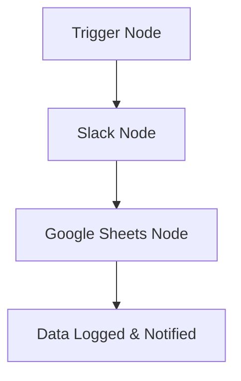

# 🚀 SmartSync: Automating Notifications and Data Logging using n8n  

> **An intelligent workflow automation system integrating Slack and Google Sheets using n8n**

---

## 🧠 Overview  

**SmartSync** is a no-code automation project built on **n8n**, designed to enhance productivity by connecting **Slack** and **Google Sheets**.  
It automatically sends notifications to Slack channels and logs important data into Google Sheets — reducing manual effort and improving collaboration.

---

## 🏗️ Architecture  



> The workflow starts with a **Trigger**, sends updates through **Slack**, and logs data into **Google Sheets** automatically.

---

## ⚙️ Features  

✨ **Instant Slack Notifications** – Keep your team updated in real time  
🧾 **Automatic Google Sheets Logging** – Store and organize data seamlessly  
🔗 **Integrated Workflow** – Combines communication + documentation  
⚡ **Customizable Nodes** – Extendable to other tools like Notion or Discord  

---

## 🧩 Tools & Technologies  

| Tool / Platform | Purpose |
|------------------|----------|
| 🌀 **n8n** | Automation & workflow orchestration |
| 💬 **Slack** | Real-time communication platform |
| 📊 **Google Sheets** | Data storage & tracking |
| 🔐 **OAuth Tokens / APIs** | Secure authentication for integration |

---

## 🔄 Workflow Steps  

1. **Trigger Node** → Starts the workflow (manual or event-based).  
2. **Slack Node** → Sends a custom message to a chosen channel.  
3. **Google Sheets Node** → Appends a new row of data automatically.  

---

## 🧰 Setup Instructions  

1. **Sign up** on [n8n.io](https://n8n.io) and open your workflow editor.  
2. Create and connect credentials:  
   - 🔑 **Slack Bot OAuth Token** → from Slack API Portal  
   - 🔑 **Google Sheets API Credentials** → linked to your Google account  
3. Prepare a Google Sheet with these columns:  
   ```
   Date | Title | Link | Description
   ```  
4. In n8n:
   - Add **Slack Node** → Select a channel → Choose “Send Message”  
   - Add **Google Sheets Node** → Operation “Append Row” → Enable “Map Automatically”  
5. **Execute Workflow** → Watch it send messages and log data automatically!  

---

## 📊 Use Cases  

💡 You can customize this workflow for:  
- YouTube upload alerts  
- Automated daily reporting  
- Task completion updates  
- CRM or marketing campaign logging  

---

## 🚧 Future Enhancements  

- 🤖 Add **AI-based summaries** of updates before posting  
- 🔔 Include **Telegram/Discord** integrations  
- 📓 Connect with **Notion/Airtable** for detailed project tracking  

---

## 🧑‍💻 Author  

**👩‍🎓 Jampelly Adwaitha**  
B.Tech Student | Automation & AI Enthusiast  

🌐 *“Simplifying workflows, one automation at a time.”*

---

## 📷 Architecture Diagram  


*(Upload your flowchart image here — e.g., the one showing Slack + Google Sheets connection)*

---

## 🏁 Conclusion  

SmartSync shows how **automation tools like n8n** can eliminate repetitive tasks, ensure consistent reporting, and enhance teamwork — making everyday operations smoother and smarter.  
